# How to notify Instana on a new release

# Integrate Instana with your Github Repository
You will need to create a secret variable on your repository. 

1) To get the INSTANA_BASE, INSTANA_TOKEN
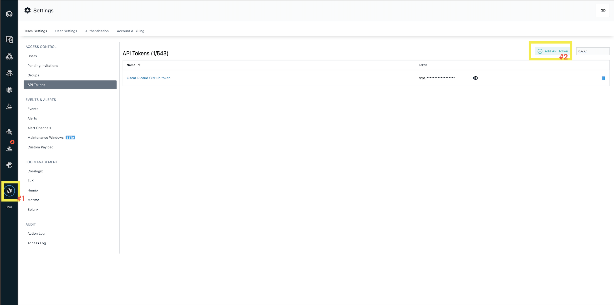
2) Enable the following fields
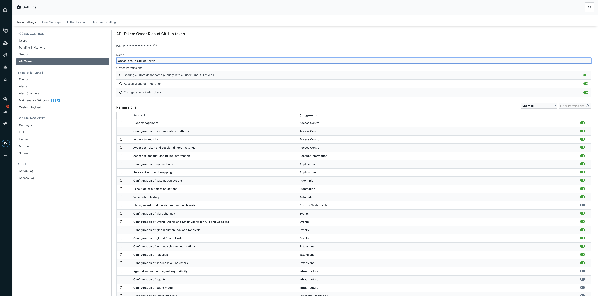
3) On github go to your `repository` and click on `Settings`
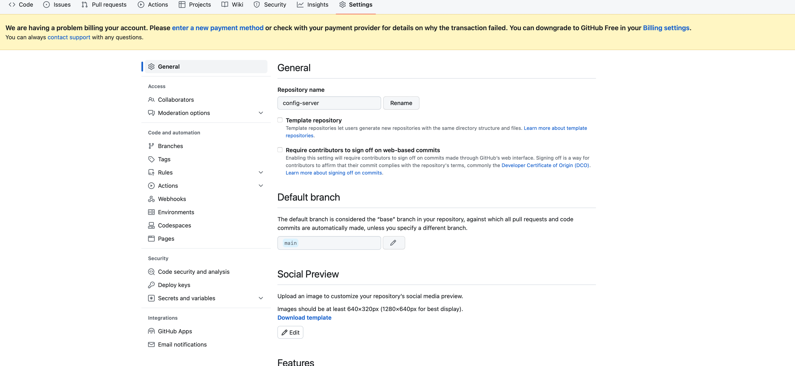
4) Go to `Secrets and Variables` and click on `actions`
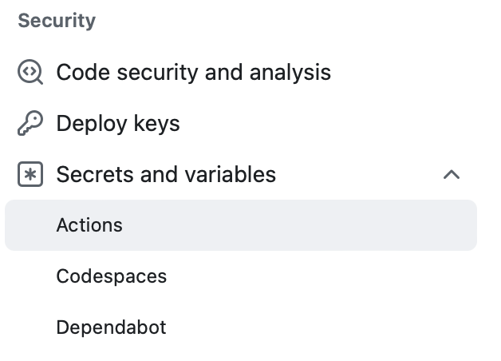
5) Click on `New Repository Secret`
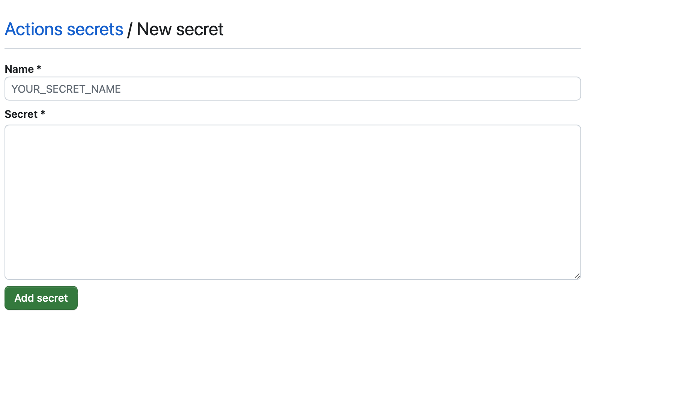
6) Fill in the values for `GH_TOKEN`, `INSTANA_BASE`, `INSTANA_TOKEN`

7) Your result should look like
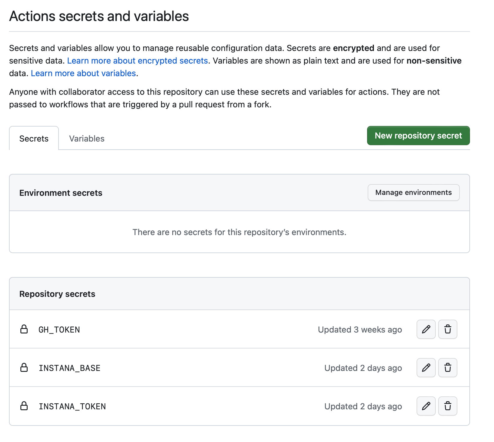
8) The `INSTANA_BASE` is your instana url. i.e `https://mysandboxenv.instana.io`
9) Your `GH_TOKEN` can be generated by accessing https://github.com/settings/profile -> clicking on developer settings -> personal access tokens -> tokens (classic)
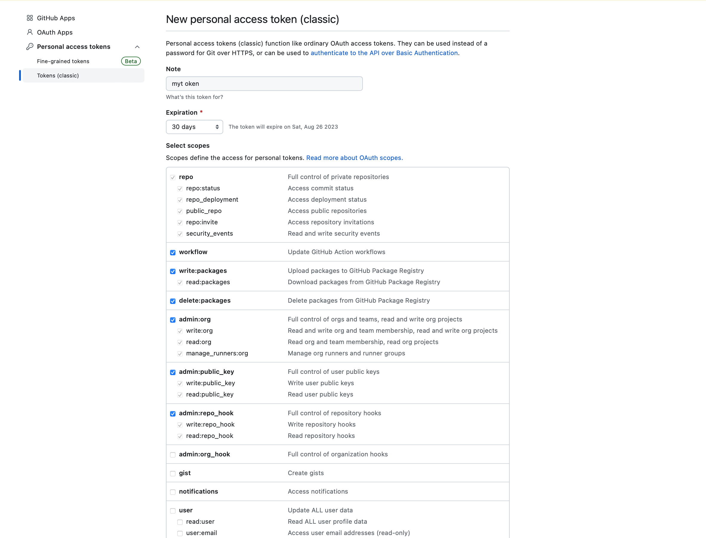
10) Enable Read and Write permissions for workflow
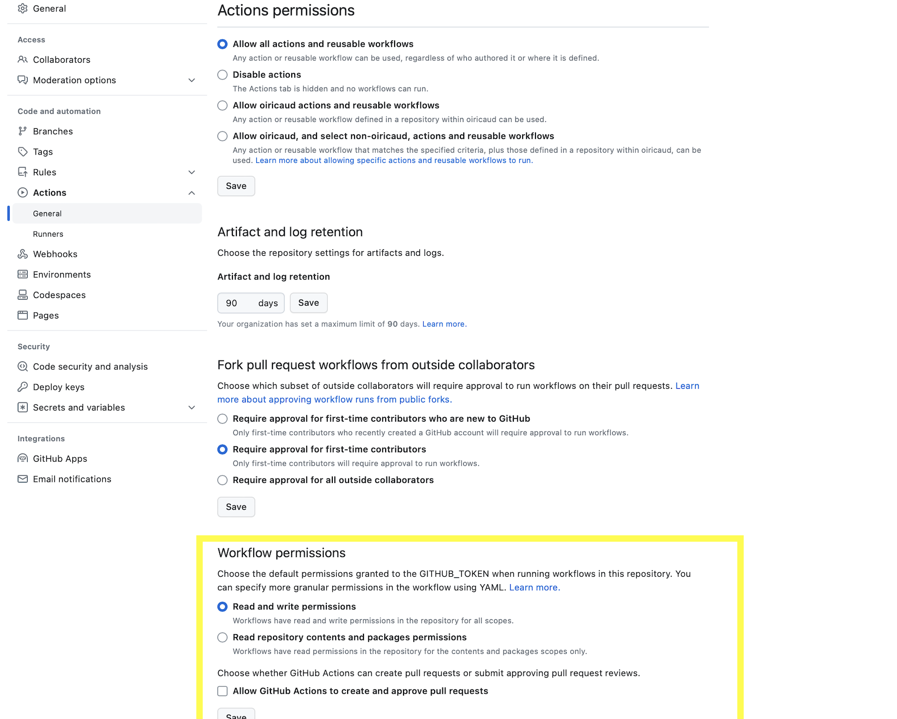
11) Identify which application perspective you want to target.
This step is important because you must update the `.github/workflows/create-release.yml` file and update the following code snippet
```
          {
            "applications": [
              {
                "name": "All Services",
                "services": [
                  { "name": "zabbix-06-PHP" }
                ]
              }
            ]
          }
```
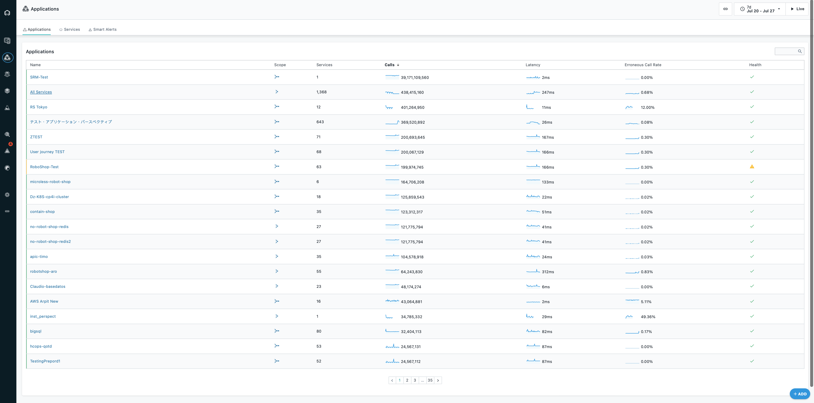
11) Go to actions -> release new version
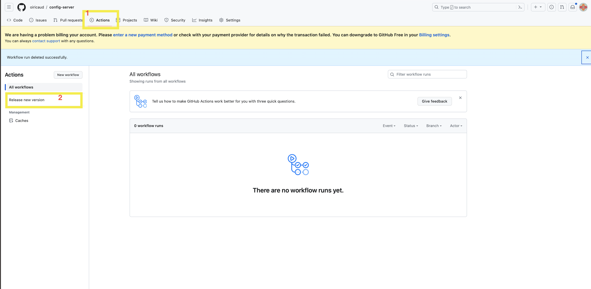
12) Run workflow specify version of release 
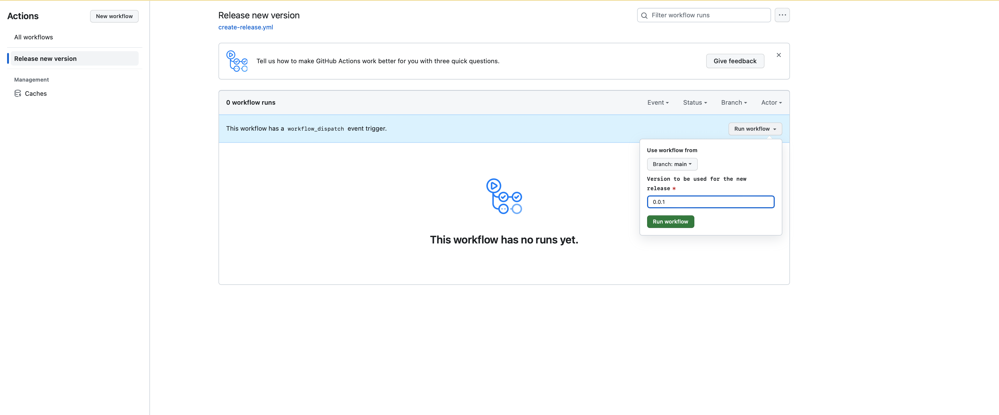
13) Wait for job to finish
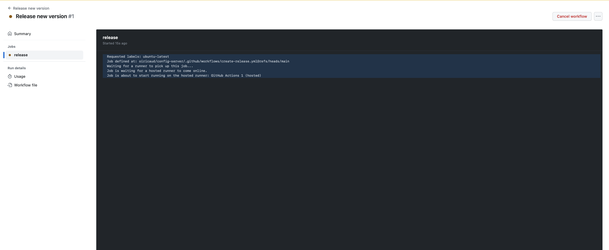
14) You should get a green checkmark that the job is done.
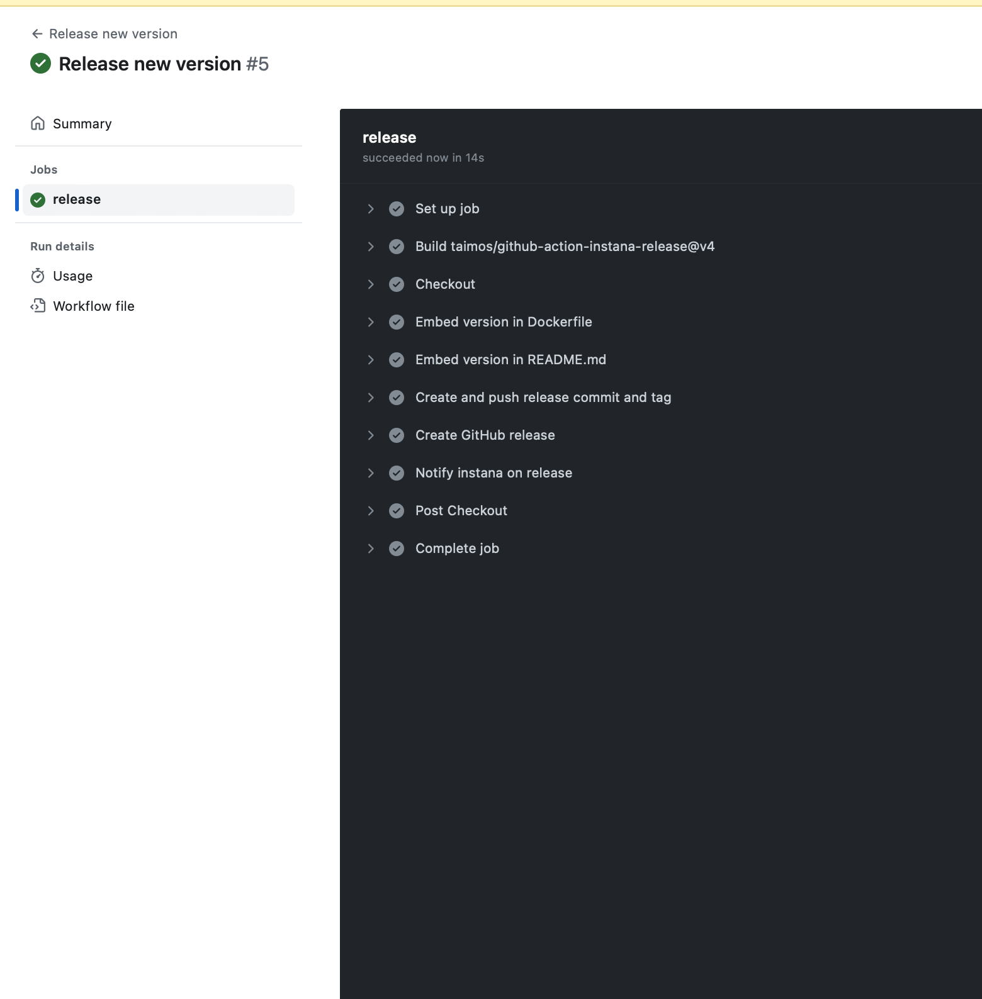
15) Verify you are able to view release on instana
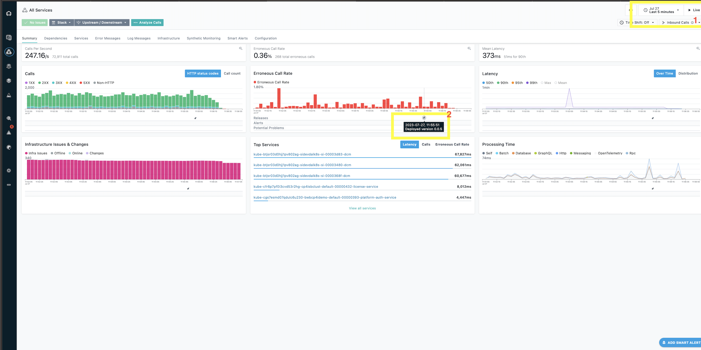
16) Done
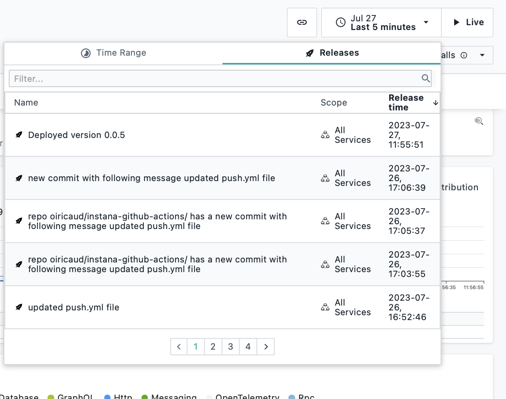